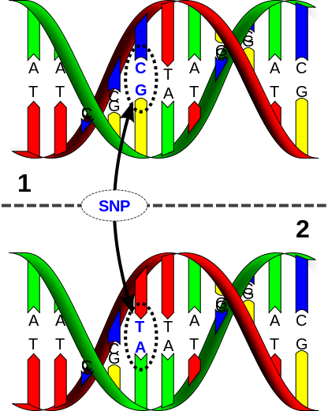

% SNP Web-portal
% D. Tosoni, D. Sicignani, U. Buonadonna
% Biomedical Informatics, 2014

# Project description

## Medical background
###**Single-Nucleotide Polymorphism**

DNA sequence variation occurring when a Single Nucleotide — A, T, C or G — in the genome (or other shared sequence) differs between members of a biological species or paired chromosomes.

\begin{center}
	\includegraphics[width=0.3\textwidth]{./Dna-SNP.png}
\end{center}

<!--

-->

## Goal
<!--
\begin{tabular}{c @{\hspace{1em}} c}
\includegraphics[width=5cm]{./Dna-SNP.png} &
saddsasadasddsaas\\
\end{tabular}
-->

\begin{center}
	\includegraphics[width=0.3\textwidth]{./imagesCAAF6KCZ.jpg}
\end{center}

Allow users to store and query Single Nucleotide Polymorphism genomics variants.

## How to reach it?
Realization of a **Web Portal**.
\vspace{7 mm}

###**Functionalities**
\vspace{3 mm}
*Super User:*

- create a "family" with one or more members
- authorize users
- modify inserted values

\vspace{2 mm}
*Authorized User:*

- search for a patient, gene, mutation, ...

# Project Structure
## Database:

###
\begin{center}
	\includegraphics[width=0.8\textwidth]{./Diagramma_Database.png}
\end{center}

## Database - Website interaction:

Occurs through queries that allow searching for:

- patient\'s SNPs 
- gene\'s SNPs
- region\'s SNPs
- all SNPs with certain Mutation, Genotype, Freq alt, ...
- patients with same SNP or Genotype
- SNPs within a genomic region
- specific SNP

## Website (User Interface):

\vspace{5mm}

Enables to load and retrieve data via user-friendly UI

\vspace{3mm}

\begin{center}
	\includegraphics[width=0.8\textwidth]{./User_PC.png}
\end{center}

# Use cases

## Use case diagram: Super User authorizes an User

###
\begin{center}
	\includegraphics[width=0.8\textwidth]{./Presentation_short_SSD_1.png}
\end{center}

## Use case diagram: Super User creates/populates a family

###
\begin{center}
	\includegraphics[width=0.55\textwidth]{./Presentation_short_SSD_2.png}
\end{center}

## Use case diagram: Super User loads data

###
\begin{center}
	\includegraphics[width=0.8\textwidth]{./Presentation_short_SSD_3.png}
\end{center}

## Use case diagram: Authorized User executes a query

###
\begin{center}
	\includegraphics[width=0.75\textwidth]{./Presentation_short_SSD_4.png}
\end{center}

# Software architecture and tecnologies

## To realize the project we will use:

###
\hspace*{25 mm}
\includegraphics[width=2cm]{./database.png}
\hfill
\includegraphics[width=2.5cm]{./model2.png}
\hspace{5 mm} Database: **MongoDB** 
\hfill
Model: **NodeJS**
\vspace{5mm}

###
\hspace*{25 mm}
\includegraphics[width=4cm]{./website.png}
\hfill
\includegraphics[width=2.5cm]{./framework.jpg}
\hspace{5 mm} Website: **AngularJS**
\hfill
Framework: **ExpressJS** 
\vspace{5mm}

## To realize the project we will use:

###
\begin{center}
	\includegraphics[width=1\textwidth]{./MEANSlide.png}
\end{center}

# Work breakdown

## Work breakdown:

- **Database**: Damian Tosoni, Ugo Buonadonna
- **Database - Website interaction**: Ugo Buonadonna, Davide Sicignani
- **Website**: Damian Tosoni, Davide Sicignani

<!-- pandoc -t beamer --slide-level 2 -V theme:CambridgeUS -s Presentation_short.md -o Presentation_short.pdf -->